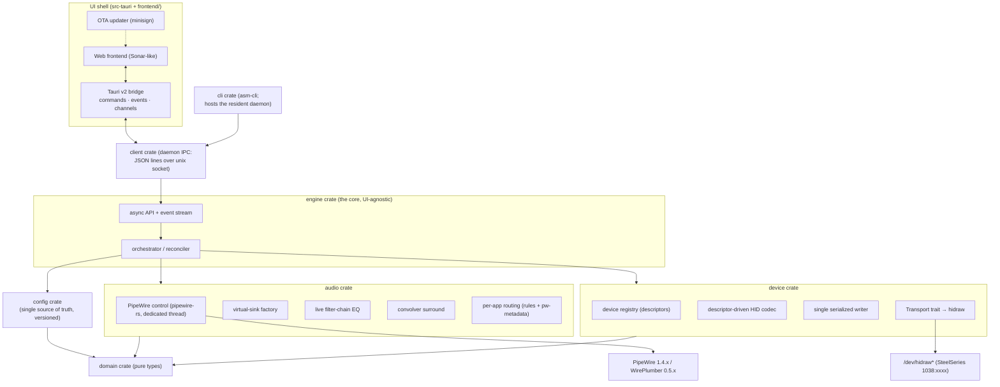
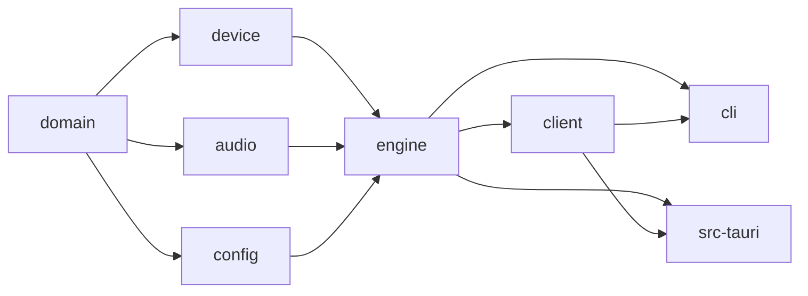
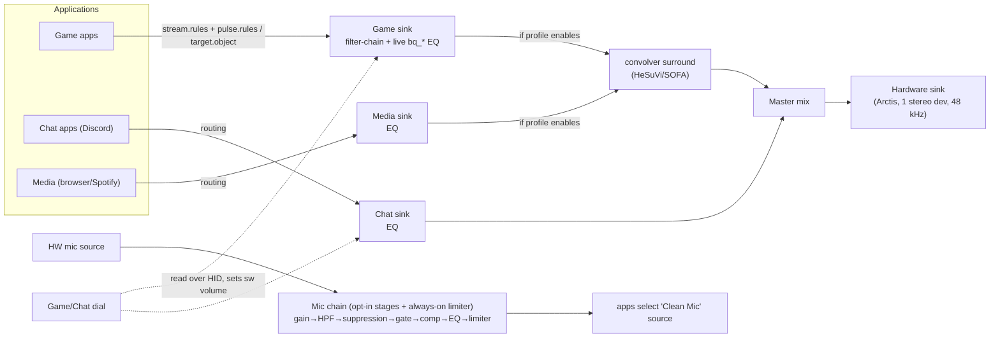
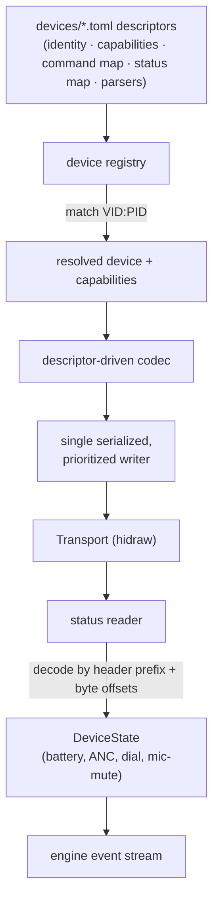

# ARCHITECTURE

Architecture diagrams and engineering guardrails for Arctis Sound Manager. This is a **living,
binding document**: all code and the implementation plan must conform to the rules in §Guardrails.
The full rationale lives in `docs/superpowers/specs/2026-06-20-arctis-sound-manager-design.md`.
UI/visual rules live in `DESIGN.md`.

---

## 1. System overview

## 2. Crate dependency direction (hard rule)

- Arrows point **toward dependents**. `domain` depends on nothing app-specific.
- **`tauri` may appear only in `src-tauri`.** No engine/device/audio/config/cli code imports it.
- No cycles. If two leaf crates need shared logic, lift it into `domain` (types) or a focused util.

## 3. Audio signal flow

Per-channel **output-device override** retargets a channel's tail from the Arctis Master to another
physical device (e.g. Media → speakers) — first-class and enforced.

**Routing persistence:** `profile.routes` is the single source of truth; `routes.json` and the conf
fragments are pure projections rebuilt from it on every persist/clear. Persistent rules are written
where PipeWire actually reads them: `stream.rules` in
`~/.config/pipewire/client.conf.d/90-asm-routing.conf` (native clients, picked up by newly launched
apps with no daemon restart) and `pulse.rules` in
`~/.config/pipewire/pipewire-pulse.conf.d/90-asm-routing.conf` (pulse clients). Live moves still go
through `pw-metadata target.object`. A stale legacy WirePlumber `node.rules` fragment (never read by
WirePlumber 0.5) is auto-removed.

**EQ:** every channel filter-chain carries an always-present `eq_preamp` linear head node
(Mult = 10^(−max boost/20), the AutoEq convention; 1.0 when nothing boosts) so boosted presets don't
clip at the float→S16 device boundary — topology stays fixed, the value updates live via Props.
Default Q: peaking 1.41 (constant-Q octave spacing), shelves 0.707 (Butterworth).

**Surround:** `Auto` follows the negotiated input layout, probed read-only from the streams feeding
the surround-routed channel sinks (stereo → bypass, 5.1/7.1 → HRIR; unprobed → optimistic HRIR 7.1).
HRIR, stereo-bypass and crossfeed graphs are level-matched: all share the same −6 dB mixer headroom
pad, and each HRIR gets a convolver `gain` normalizing its direct-path peak to 1.0 (±12 dB clamp).
Recreation is diffed first: when the rendered conf is byte-identical to disk and the node is live,
the teardown+respawn is skipped (no audible dropout). The convolver supports an optional `tailsize`
alongside `blocksize` (both validated: power of two in 64..=8192, tailsize ≥ blocksize).

**Mic chain** (fixed order): gain → highpass → suppression → gate → compressor → EQ → limiter. The
gate sits before the compressor so it keys on the true noise floor; the final stage is an always-on
−1 dBFS output limiter (`hard_limiter_1413`). DSP stages remain opt-in per G5.

## 4. Device layer

Capability flags gate **both** what the engine sends and what the UI renders. Adding a device = add a
descriptor file; **no code changes**.

**hidraw build deps:** `hidapi` uses the C `linux-static-hidraw` backend (libudev-based enumeration);
the pure-Rust `linux-native` backend does not enumerate the Nova Pro Wireless. Build requires
`libudev` (`systemd-devel`) + a C compiler (`gcc`/`clang`).

## 5. Control / data flow (UI ↔ engine)

- Commands (request/response): `Result<T, E>` via Tauri `#[command]`.
- Events: state changes (device connect/disconnect, profile switch).
- Channels: streamed telemetry (battery, level meters, live EQ feedback).
- The PipeWire main loop runs on its **own dedicated thread** (pipewire-rs types are `!Send`); it
  communicates with the engine via `pipewire::channel` (into the loop) and `mpsc` (out of the loop).

### Daemon IPC protocol

- Newline-delimited JSON `Request`/`Response` over `$XDG_RUNTIME_DIR/arctis-sound-manager.sock`
  (`client` crate on the caller side; the daemon lives in `cli` as `asm-cli daemon`).
- **Version handshake:** every daemon `Response` carries `daemon_version` (the cli crate's
  `CARGO_PKG_VERSION`; serde-default, so old/new peers interoperate). Responses may also carry an
  advisory `note` (e.g. the restore-stream caveat on `RouteClear`) — the CLI prints it.
- **Timeout discipline (no call path may wedge the daemon):** 10 s read timeouts and 1 MiB line
  caps on *both* sides of the socket (the client allows 25 s for the slow `ChatmixValidate`);
  subprocess helpers (`pw-cli`/`pw-dump`/`wpctl`…) are bounded at 5 s with a typed
  `AudioError::Timeout`; the device worker NAKs queued commands ("device not connected") when no
  headset is open, and the engine bounds every device reply wait (10 s; 20 s for ChatMix
  validation) with typed errors.
- Spawned filter-chain children are tracked in a process-global registry and reaped
  (SIGTERM → bounded wait → SIGKILL escalation) — no zombies.
- A config that fails to load is **quarantined** to `config.toml.corrupt-<ts>` (never overwritten
  by defaults) and surfaced as `EngineState.config_degraded`.
- systemd user unit: `TimeoutStopSec=15` + `KillMode=mixed`; the packaged file mirrors
  `render_unit` in `src-tauri/src/daemon_control.rs` (test-enforced). No `RuntimeDirectory` — the
  socket lives directly in `$XDG_RUNTIME_DIR`.

### GUI polling & meters

- The window is shown only after first paint (`show_when_ready`); `--hidden` tray launches stay
  hidden. Polls are visibility-gated: state 250 ms → 3 s and streams 1.5 s → 10 s while hidden;
  events (`state-changed`, `streams-changed`) emit only on change, plus an edge-triggered
  `daemon-down`. EQ/volume drag ticks use ack-only commands (no state round-trip until release).
- Meter `pw-record` workers start on the first subscriber and stop on the last (or on window
  hide), respawning with bounded backoff when a child exits.

---

## Guardrails (binding)

### G1 — Reuse over duplication
- Prefer **generic utilities with dynamic parameters** to bespoke copies: one biquad-band builder, one
  descriptor-driven HID codec, one virtual-sink factory, one filter-chain config generator.
- Behavior differences across devices come from **data (descriptors) + capability flags**, not branches
  scattered through code.
- Before writing new logic, check whether an existing util can be parameterized.

### G2 — Hardware safety (non-negotiable)
- **Never write the OLED display.**
- **Never replay reverse-engineered/unverified init opcodes.**
- Every **write** capability must be **validated against real hardware** before it is enabled.
- All device writes go through **one serialized, prioritized writer**. No concurrent USB writes.
- Reads are safe and used by default. **Surface write failures** — never silently swallow USB errors.
- Prefer `hidraw`; detect an in-kernel `hid-steelseries` driver and prefer sysfs if it owns the device.

### G3 — Audio engine
- **EQ edits apply live** via `pw_node_set_param(SPA_PARAM_Props)` — never rewrite a `.conf` or restart
  a service to change a parameter.
- 48 kHz end-to-end; no resampling on the device path.
- Operations are **idempotent**: reconcile against existing PipeWire objects (stable `node.name`) rather
  than blindly recreating them.
- Respect streams the user has manually pinned (`target.object`). WirePlumber's `restore-stream`
  state cannot be cleared per-app without a WirePlumber restart (which this guardrail forbids), so a
  cleared route instead carries an advisory `Response.note` telling the user how to re-teach the
  stored target — see `KNOWN_ISSUES.md` KI-6.

### G4 — Single source of truth
- One authoritative, **schema-versioned** config store with migrations. No scattered dotfiles.
- A Profile is a complete bundle; views read from the same model — no parallel state that can desync.

### G5 — Microphone defaults
- Default mic path is **clean passthrough**. Every DSP stage is **opt-in** with conservative defaults.
- Noise suppression strength maps to a **capped attenuation** (the anti-"tinny" control).

### G6 — Module boundaries & file discipline
- `engine` and below never depend on `tauri`. UI components never contain engine logic.
- Keep files focused and small; a file growing large is a signal it does too much — split it.
- Each unit answers: what does it do, how is it used, what does it depend on?

### G7 — Errors & observability
- Typed errors (`thiserror`) across crate boundaries; no `unwrap()`/`expect()` on fallible runtime paths.
- User-visible failures are explicit (a control that didn't apply must say so), addressing the old app's
  "hit-or-miss" feel.

### G8 — Testing
- `domain`/EQ-math/config (de)serialization: pure unit tests.
- `device`: mock `Transport` with recorded byte fixtures; encode/decode tested with no hardware in CI.
- `audio`: unit-test generated configs/`Props` payloads/routing requests; gate live-PipeWire integration
  tests behind a flag.
- `cli`: real-hardware end-to-end harness, kept out of the default CI gate.

### G9 — Packaging / OTA
- Primary artifact: **AppImage** + Tauri signed updater. Ship/install the `1038:12e5` udev rule
  (first-run `pkexec`). `.deb`/`.rpm` are convenience only. **Not Flatpak** (sandbox blocks hidraw +
  PipeWire routing).

### G10 — Coexistence
- On first run, detect the legacy stack (RPM app, its filter-chain instance, `Arctis_*` loopbacks,
  `hrir-switch`) and offer to disable/uninstall it before claiming the USB endpoint and sink namespace.
  Tear down our own objects cleanly on exit.
