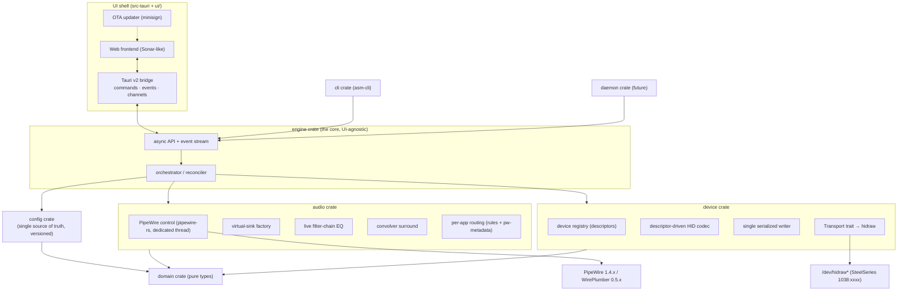
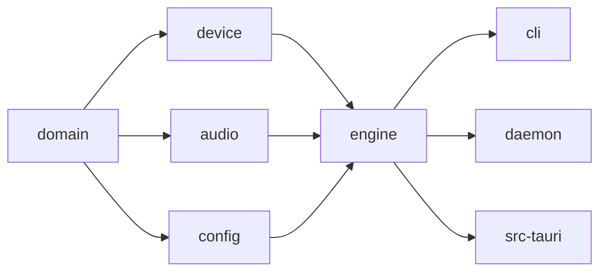
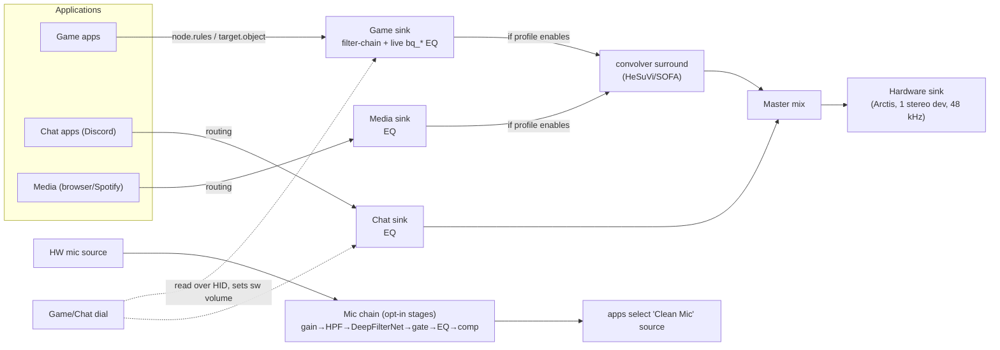
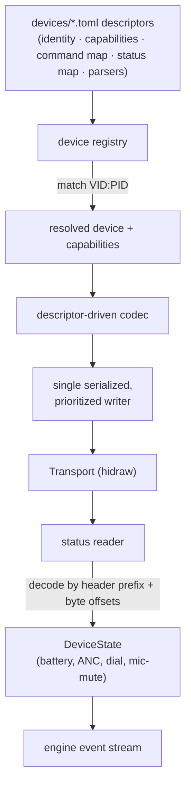

# ARCHITECTURE

Architecture diagrams and engineering guardrails for Arctis Sound Manager. This is a **living,
binding document**: all code and the implementation plan must conform to the rules in §Guardrails.
The full rationale lives in `docs/superpowers/specs/2026-06-20-arctis-sound-manager-design.md`.
UI/visual rules live in `DESIGN.md`.

---

## 1. System overview

## 2. Crate dependency direction (hard rule)

- Arrows point **toward dependents**. `domain` depends on nothing app-specific.
- **`tauri` may appear only in `src-tauri`.** No engine/device/audio/config/cli code imports it.
- No cycles. If two leaf crates need shared logic, lift it into `domain` (types) or a focused util.

## 3. Audio signal flow

Per-channel **output-device override** retargets a channel's tail from the Arctis Master to another
physical device (e.g. Media → speakers) — first-class and enforced.

## 4. Device layer

Capability flags gate **both** what the engine sends and what the UI renders. Adding a device = add a
descriptor file; **no code changes**.

**hidraw build deps:** `hidapi` uses the C `linux-static-hidraw` backend (libudev-based enumeration);
the pure-Rust `linux-native` backend does not enumerate the Nova Pro Wireless. Build requires
`libudev` (`systemd-devel`) + a C compiler (`gcc`/`clang`).

## 5. Control / data flow (UI ↔ engine)

- Commands (request/response): `Result<T, E>` via Tauri `#[command]`.
- Events: state changes (device connect/disconnect, profile switch).
- Channels: streamed telemetry (battery, level meters, live EQ feedback).
- The PipeWire main loop runs on its **own dedicated thread** (pipewire-rs types are `!Send`); it
  communicates with the engine via `pipewire::channel` (into the loop) and `mpsc` (out of the loop).

---

## Guardrails (binding)

### G1 — Reuse over duplication
- Prefer **generic utilities with dynamic parameters** to bespoke copies: one biquad-band builder, one
  descriptor-driven HID codec, one virtual-sink factory, one filter-chain config generator.
- Behavior differences across devices come from **data (descriptors) + capability flags**, not branches
  scattered through code.
- Before writing new logic, check whether an existing util can be parameterized.

### G2 — Hardware safety (non-negotiable)
- **Never write the OLED display.**
- **Never replay reverse-engineered/unverified init opcodes.**
- Every **write** capability must be **validated against real hardware** before it is enabled.
- All device writes go through **one serialized, prioritized writer**. No concurrent USB writes.
- Reads are safe and used by default. **Surface write failures** — never silently swallow USB errors.
- Prefer `hidraw`; detect an in-kernel `hid-steelseries` driver and prefer sysfs if it owns the device.

### G3 — Audio engine
- **EQ edits apply live** via `pw_node_set_param(SPA_PARAM_Props)` — never rewrite a `.conf` or restart
  a service to change a parameter.
- 48 kHz end-to-end; no resampling on the device path.
- Operations are **idempotent**: reconcile against existing PipeWire objects (stable `node.name`) rather
  than blindly recreating them.
- Respect streams the user has manually pinned (`target.object`); manage `restore-stream` so it doesn't
  fight our rules.

### G4 — Single source of truth
- One authoritative, **schema-versioned** config store with migrations. No scattered dotfiles.
- A Profile is a complete bundle; views read from the same model — no parallel state that can desync.

### G5 — Microphone defaults
- Default mic path is **clean passthrough**. Every DSP stage is **opt-in** with conservative defaults.
- Noise suppression strength maps to a **capped attenuation** (the anti-"tinny" control).

### G6 — Module boundaries & file discipline
- `engine` and below never depend on `tauri`. UI components never contain engine logic.
- Keep files focused and small; a file growing large is a signal it does too much — split it.
- Each unit answers: what does it do, how is it used, what does it depend on?

### G7 — Errors & observability
- Typed errors (`thiserror`) across crate boundaries; no `unwrap()`/`expect()` on fallible runtime paths.
- User-visible failures are explicit (a control that didn't apply must say so), addressing the old app's
  "hit-or-miss" feel.

### G8 — Testing
- `domain`/EQ-math/config (de)serialization: pure unit tests.
- `device`: mock `Transport` with recorded byte fixtures; encode/decode tested with no hardware in CI.
- `audio`: unit-test generated configs/`Props` payloads/routing requests; gate live-PipeWire integration
  tests behind a flag.
- `cli`: real-hardware end-to-end harness, kept out of the default CI gate.

### G9 — Packaging / OTA
- Primary artifact: **AppImage** + Tauri signed updater. Ship/install the `1038:12e5` udev rule
  (first-run `pkexec`). `.deb`/`.rpm` are convenience only. **Not Flatpak** (sandbox blocks hidraw +
  PipeWire routing).

### G10 — Coexistence
- On first run, detect the legacy stack (RPM app, its filter-chain instance, `Arctis_*` loopbacks,
  `hrir-switch`) and offer to disable/uninstall it before claiming the USB endpoint and sink namespace.
  Tear down our own objects cleanly on exit.
